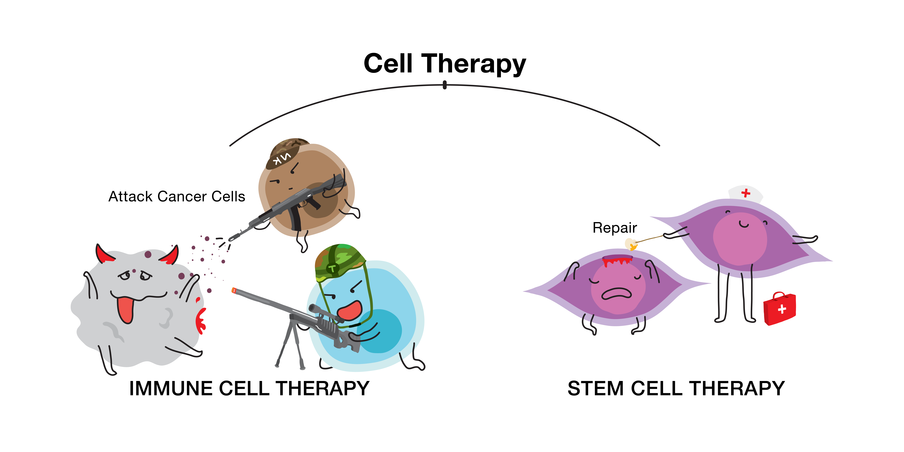
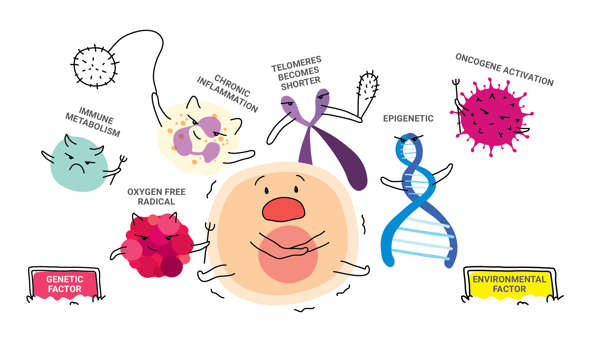

<h1>Cell Therapy</h1>

Have you thought about it? When you’re approaching middle age going towards 60s, 70s or 80s, or even your 90s, what will be your physical condition?

Aging is a natural law in life, and no one can escape from it. With the passage of time, environmental and genetic factors will leave traces of aging on every organism, such as loss of moisture on skin, dry skin, wrinkles, hyperpigmentation, memory loss, hair loss, and decline in immune system. Although everyone can’t resist aging, with the booming era of medicine in the 21st century, we can delay aging through cell therapy by strengthening our immune system, and improve the quality of life.

Cell therapy is the process of introducing new cells into a tissue, thereby activating the body’s “self-healing function” and building a complete and powerful immune system to treat disease.

There are two main types of cell therapy , which are **Stem Cell Therapy** and **Immune Cell Therapy**.

### 1 Stem Cell Therapy

Stem cell therapy refers to the use of stem cells or cells derived from stem cells, which are transplanted into the body using special techniques to replace or repair patients’ damaged cells, cellular tissues or organs.

### 2 Immune Cell Therapy

Immune cell therapy is the use of its own immune cells such as natural killer cells (NK cells), dendritic cells (DC cells), B cells and T cells to effectively target any foreign substance in the patient such as bacteria or cancer cells.

### THE MAIN CAUSES OF CELL DAMAGE

With the rapid research and development in the medical and biological fields, people gradually understand that the factors of aging and aging diseases are caused by poor daily life habits and inheritance, which are the main causes of cell damage.

### ENVIRONMENTAL FACTORS

1. **Chronic Inflammation** 
   Chronic inflammation is caused by inflammatory factors that persist in damaging tissues. When the body is in “chronic inflammation” for a long time, it may induce a series of serious diseases and damage the health.
2. **Oxygen free radicals** 
   Human metabolites can cause damage to the human body. It becomes the main factor leading to human diseases, aging and death, endangering human health and longevity.
3. **Immune metabolism** 
   Age of immune metabolism, infectious factors, obesity, diet, etc. all have important effects on immune cell metabolism. Immune metabolism can be divided into two parts:
   1. The function of immune cells can metabolize and regulate adipose tissue and liver and other organs throughout the body.
   2. Metabolic pathways in immune cells can regulate the immune response.

### GENETIC FACTORS

1. **Telomere shortening** 
   Telomere shortening is like a mitotic clock. Shortening telomere is a molecular clock that triggers aging. Its average length will decrease or disappear with the increase of the numbers of cell divisions and age, which will lead to the decline of chromosomal stability, which is also an important factor that causes aging.
2. **Oncogene activation** 
   Oncogene activation can cause normal cells to become cancerous, erosive, and metastatic. Activation methods includes mutation, gene amplification, chromosomal rearrangement, and viral infection.
3. **Epigenetic** 
   Gene function in the case of the gene sequence does not occur, resulting in a heritable change and no apparent changes.
