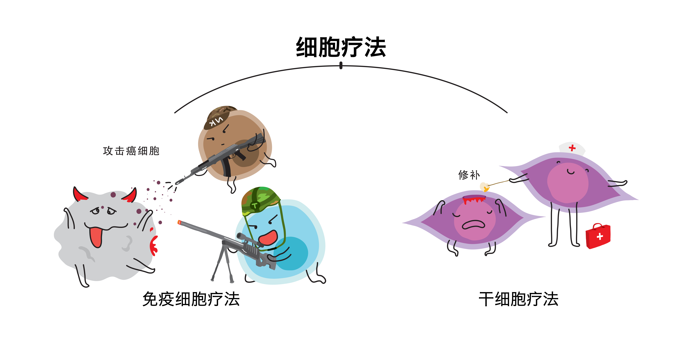
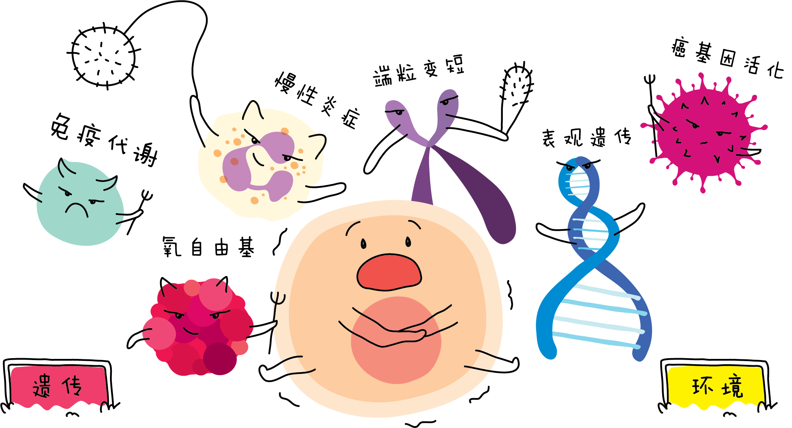

<h1>细胞疗法</h1>

您有想过吗？当您开始步入中年至达到 60 岁、70 岁或 80 岁，甚至到 90 多岁时，您的身体是处于怎么样的状态呢？

衰老是人生中的一种自然规律，谁也无法躲过。随着岁月的流逝，环境和遗传等因素，每个⼈身上都会留下衰老的痕迹，比如皮肤失去水分、皮肤干燥、皱纹产生、色素沉着、记忆力减退、头发脱落、抵抗力下降等衰老现象逐渐出现。虽然每个人都无法抵抗衰老，但随着 21 世纪医学蓬勃发展的时代，我们可以透过细胞疗法延缓衰老，增强自身的免疫能力，从而提高生活品质。

细胞疗法是往一个组织中引入新的细胞，借此激活人体的「自愈功能」，並建立完善而又強大的免疫系统，以治疗疾病的过程。

细胞疗法主要分成兩种，**干细胞疗法** 和 **免疫细胞疗法**。

### 1 干细胞疗法

干细胞疗法是指利用干细胞或干细胞衍生的细胞，以特殊技术移植至体内，取代或修复病人受损的细胞、细胞组织或器官。

### 2 免疫细胞疗法

免疫细胞疗法是利用自身的免疫细胞如自然杀手细胞(NK 细胞)， 树突细胞(DC 细胞)， B 细胞和 T 细胞等在患者自身免疫系统的力量有效地靶向定位攻击任何外来物质，如细菌或癌细胞。

### 细胞遭受破坏的主因

随着医疗和生物学领域飞速的研究与发展，人们渐渐了解衰老及衰老疾病的因素是源于不良的生活作息和遗传，都是导致细胞遭受破坏的主要原因。

### 环境因素

1. **慢性炎症** 
   慢性炎症是因致炎因子持续存在损伤组织而逐渐而成。当身体长期处于“慢性发炎”，可能会诱导一系列严重疾病，损害健康。
2. **氧自由基** 
   人体的代谢产物，可以造成生物膜系统损伤以及细胞内氧化磷酸化障碍。 成为人体疾病、衰老和死亡的直接参与者，危害着人体的健康和寿命。
3. **免疫代谢** 
   年龄、感染因素、肥胖、饮食作息等都对免疫细胞代谢产生重要影响。免疫代谢能分成两个部分:
   1. 免疫细胞的作用能全身代谢和调节脂肪组织及肝脏等器官。
   2. 免疫细胞内代谢通路可以调节免疫反应。

### 遗传因素

1. **端粒变短** 
   端粒有如一种有丝分裂钟，端粒变短是触发着衰老的分子钟。它的平均长度将随着细胞的分裂次数增加，年龄的增长而变短甚至消失， 导致染色体稳定性下降，这也是引发衰老的一个重要因素。
2. **癌基因活化** 
   癌基因活化后可导致正常细胞癌变、侵蚀和转移。活化的方式包括点突变、基因扩增、染色体重排、病毒感染等。
3. **表观遗传** 
   基因功能在基因序列没有发生的情况下，产生了可遗传的变化而导致了表观的变化。
