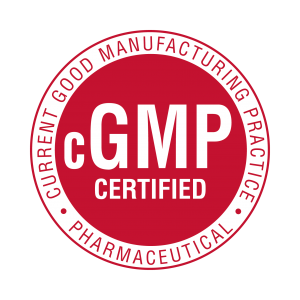

<h1>国际标准</h1>

依据国际标准，干细胞应在拥有《药品生产质量管理规范》(cGMP) (PIC/S)认证和标准的实验室进行处理。

cGMP ( Current Good Manufacturing Practice) 《药品生产质量管理规范》实验室设施与设备 cGMP 认证的实验室是联邦政府制定的标准。cGMP 提供了确保制造过程和设施的正确设计、监视和控制的系统。 遵守 cGMP 法规要求药品制造商充分控制生产操作，从而确保药品的特性、强度、质量和纯度。 这包括建立强大的质量管理体系，获取适当质量的原材料，建立可靠的操作程序，检测和调查产品质量偏差以及维护可靠的测试实验室。 如果充分实施了制药公司的这种正式的控制系统，则有助于防止污染、混淆、偏差、故障和错误的发生。 这样可以确保药品符合其质量标准。

然而，一些国家的法规对家庭干细胞储存库的要求与对公共干细胞储存库的要求相同。

但是在大多数国家，联邦对家庭干细胞储存库的要求并不像公共干细胞储存库那样严格。因此需要自愿认证。例如欧洲的 JACIE。 在美国，FDA (Food and Drug Administration) 建立了 GMP 标准。 FDA 将 GMP 标准应用于药物和医疗设备。 新的 FDA BLA（联邦生物制剂许可证申请）要求公共脐带血库像应对待药品一样处理脐带血，并遵守 GMP 标准。

建立 cGMP 的要求是灵活的，以便允许每个制造商通过使用科学合理的设计、处理方法和测试程序来分别决定如何最好地实施必要的控制。 这些法规的灵活性使公司可以使用现代技术和创新方法，通过不断改进来达到更高的质量。 因此，cGMP 中的“ c”代表“当前”，要求公司使用最新的技术和系统以符合法规。

除此之外，细胞必须按照国际细胞治疗学会(ISCT)和行内最佳惯例的规定测试细胞和上清液的质量（征兆，支原体，内毒素等）。
