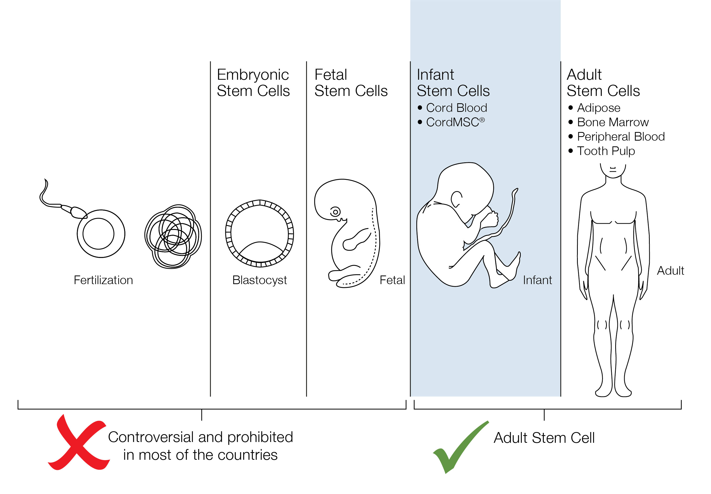
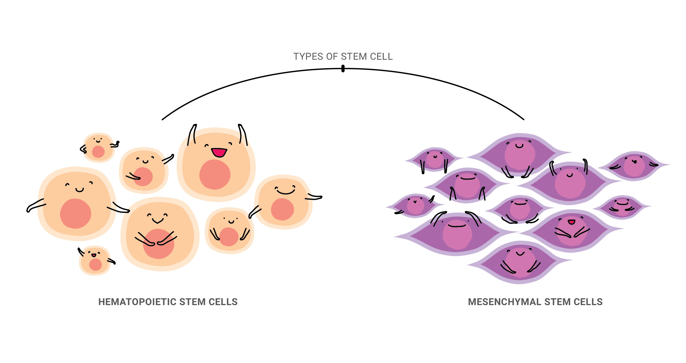

<h1>Stem Cells</h1>

### Introduction

What are stem cells?

Stem cells are the primary cells of the human body. Every other cell is derived from a stem cell, including blood cells, nerve cell, etc. It acts as a ‘producer’ of new human cells and orchestrates the different cells that reside in the human body.

In the initial phase of human liftcycle, fertilized egg divide into embryonic stem cells, and then continue to differentiate into various cells to form a complete human being. Besides, these stem cells also migrate to different parts of the body for tissue repair and regeneration such as during trauma or injury. However, the number of stem cells in the human body gradually decreases with age, which in turn causes aging.

### Properties of stem cells

1. Self-renewal – ability to go through multiple cell division cycles while maintaining its undifferentiated state.
2. Multi-potency – ability to produce different cell types.

### Classification of stem cells

<ol>
<li>Based on differentiation potential, stem cells can be classified into 4 – **totipotent, pluripotent, multipotent** and **unipotent**. 
<ol>
1. **Totipotent stem cells** can form all the cell types in a body, plus the embryonic stem cells (ESCs).
1. **Pluripotent stem cells** have the potential to differentiate into a variety of cellular tissues, such as induced stem cells (iPSCs).
1. **Multipotent stem cells** have the ability to proliferate and differentiate into multiple tissues, such as hematopoietic stem cells (HSCs) and Mesenchymal stem cells (MSCs).
1. **Unipotent stem cells** can only differentiate into one or two closely related cell types, such as epithelial tissue cells.
</ol>
</li>
<li>Stem cells can also be classified according to development stage – **embryonic** and **adult**.

  <ol>
    <li>**Embryonic Stem Cells** are derived from the inner cells of a blastocyst.  These are highly undifferentiated cells that can be differentiated into various types of cells, tissues, and even organs of the human body.  They have huge application prospects in the field of regenerative medicine.  Embryonic stem cell research, especially human embryonic stem cell research, often causes ethical, religious, and legal disputes.  Most countries and regions have imposed certain restrictions on embryonic stem cell research and marked illegal.</li>
    <li>**Adult Stem Cells** are undifferentiated cells that can be found throughout the body, including neural stem cells, hematopoietic stem cells, mesenchymal stem cells, and epidermal stem cells.  These adult stem cells have the ability to repair and regenerate.</li>
  </ol>
</li>

Adult stem cells can be divided into two main categories.

<ol style="list-style-type: none;">
<li>

  <ol>
    <li>

**Hematopoietic Stem Cells (HSCs) :** HSCs are multifunctional cells that can be extracted from bone marrow, umbilical cord blood, and adult peripheral blood. HSCs can be differentiated into red blood cells, white blood cells and platelets. They can be used for cellular therapy in blood diseases, such as blood cancer (marrow / umbilical cord blood transplantation), thalassemia, etc.

   </li>
   <li>

**Mesenchymal Stem Cells (MSCs) :** MSCs can be found in umbilical cord, bone marrow, fat, and dental pulp. They can be used to repair cells and tissues such as nerve, heart, liver, lung, kidney, bone and other organs. They are also quite effective in treating spinal cord injury, cirrhosis, stroke, arthritis, dementia, etc. At present, this type of cell is also widely used in anti-aging and health treatments.

   </li>
  </ol>
</li>
</ol>
