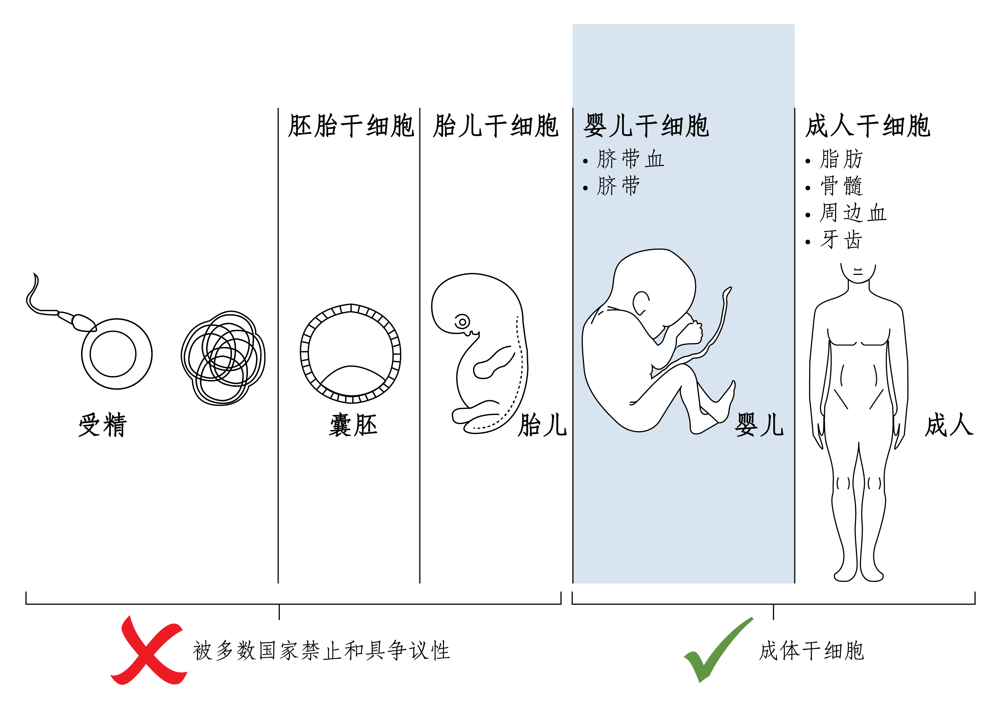
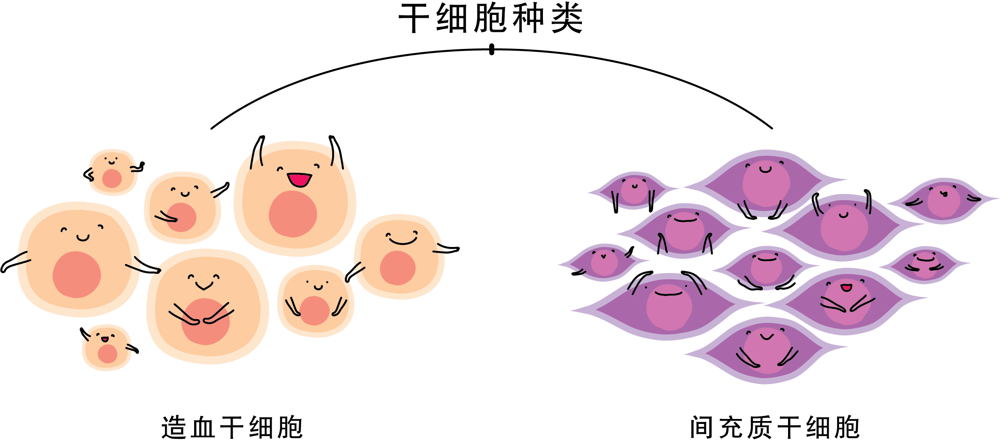

<h1>干细胞解说</h1>

### 何谓干细胞

干细胞是人体的主细胞。 所有的细胞都是源自于干细胞，这包括血液细胞，神经细胞等。

它是人体新细胞的供应商，也是一位全能的指挥家，它就是操控和运⾏生命的主要元素。人体內有许许多多种干细胞，它们的工作就是制造其它种类的细胞。像是人的生命最初，就是由受精卵分裂成胚胎干细胞，再不断分化增生各种不同功能的细胞，形成一個完整的⼈。

這些干细胞会潜入每个器官中，待生病受伤时，就开始负责修复与再生工作。但在自然法则中，干细胞会随着年龄增长而逐渐下降，所以人会变老，器官会面临坏死。

### 干细胞的属性

1. 自我更新 – 经过多个细胞分裂周期同时仍保持其未分化状态的能力
2. 多分化能性 (multi-potency) – 产生几种不同细胞类型。

### 干细胞的分类

<ol>
<li>依据分化潜能，干细胞可分为 – **全能干细胞、多能干细胞、多潜能干细胞、单能干细胞** 
<ol>
1. **全能干细胞（Totipotent）** 具有形成完整个体的分化潜能。 如胚胎干细胞（ESCs)。
1. **多能干细胞（Pluripotent）** 具有分化出多种细胞组织的潜能。如诱导性干细胞(IPSCs)。
1. **多潜能干细胞（Multipotent）** 具有增殖与分化成多种组织能力的细胞。如造血干细胞(HSCs)和间充质干细胞(MSCs)。
1. **单能干细胞 （Unipotent）** 只能向一种或两种密切相关的细胞类型分化。如上皮组织细胞。
</ol>
</li>
<li>依据发育阶段可分类为 – **胚胎干细胞、成体干细胞**.

  <ol>
    <li>**胚胎干细胞（Embryonic Stem Cell）**  胚胎干细胞来自囊胚的内细胞群。它是一种高度未分化的细胞，可分化为人体的各类细胞、组织，甚至器官。它在再生医学领域拥有巨大的应用前景。胚胎干细胞研究，尤其是人类胚胎干细胞的研究常常会引起伦理、宗教以及法律上的争议，大部分国家和地區都对胚胎干细胞研究施加了一定的限制且属于不合法。</li>
    <li>**成体干细胞（Adult Stem Cell）** 成体干细胞是未分化的细胞，发育后可以在整个身体内发现，包括神经干细胞（Neural Stem Cells）、血液干细胞（Hematopoietic Stem Cells）、间充质干细胞（Mesenchymal Stem Cells）、表皮干细胞（Epidermal Stem Cells）等。这些成体干细胞具有修复和再生的能力。</li>
  </ol>
</li>

成体干细胞主要可以分为两大类：

<ol style="list-style-type: none;">
<li>

  <ol>
    <li>

**造血干细胞（Hematopoietic Stem Cell）：** 造血干细胞是个多功能细胞，可在骨髓、脐带血及成人周边血中萃取。可分化为红血球、白血球、血小板和免疫细胞应用在血液与免疫方面的疾病，如血癌（骨髓/脐带血移植）、地中海贫血症等。

   </li>
   <li>

**间充质干细胞（Mesenchymal Stem Cell）：** 间充质干细胞可从脐带、骨髓、脂肪、牙髓中萃取，拥有优秀的多向分化能力，适当培养后可应用于神经、心脏、肝脏、肺脏、肾脏、骨骼等器官受损的修复，对脊髓受伤、肝硬化、中风、关节炎、老年痴呆等相当有效。目前，这类型的细胞也非常地广泛用于抗哀老和保健疗法。

   </li>
  </ol>
</li>
</ol>
